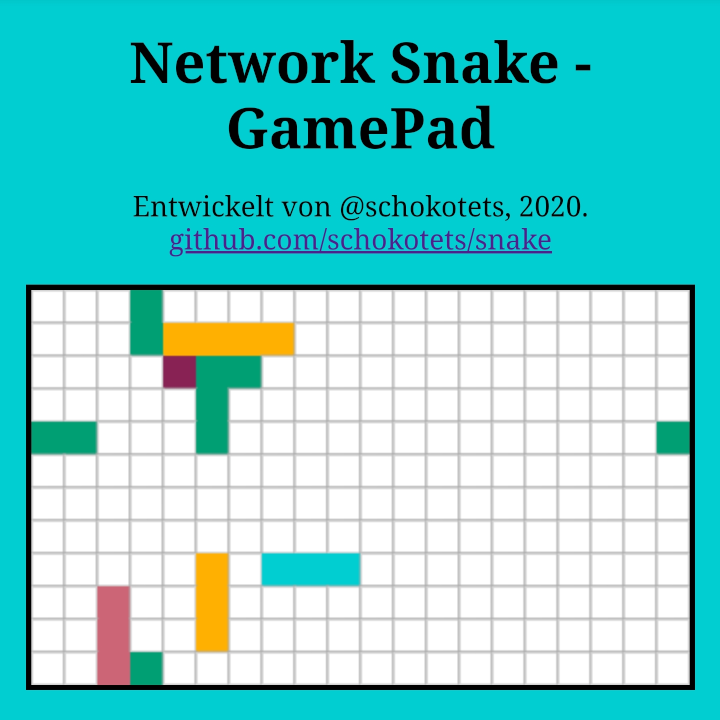

# Network Snake



This game a clone of the historic game "Snake" built using a python server and WebSocket clients.
It's meant as a fun demo for networking, since it can easily be run in local networks.
Your smartphone can most likely be used as a controller if you enter the following address in your browser:
`http://<host machine ip>:8080/controller.html`. There, the game can be viewed and controlled by tapping the arrow buttons.
You can also watch the game on the host by visiting `http://localhost:8080`.
Make sure the host allows tcp connections to ports 8080 & 8090.

The project is licensed under the ISC License.

## Game

The game is a clone of snake. The mechanics are familiar.
When a snake eats a purple-colored food pixel it grows by one pixel.
The snakes are "teleported" to the opposing wall instead of crashing.
Once a snake collides with itself/another snake, it simply starts over.
There is a timeout of about 20 seconds for idle players, since websockets don't always seem to get closed (cleanly).

## Architecture

There are four components to the server:
* a simple http server providing the frontend [port 8080]
* a websocket server to handle data transfer (player controls and game state) (1) [port 8090]
* a game state manager that's updating at set times and processing user input
* deprecated: a UDP server to receive packets from WiFi Chips (2) [port 9900]

1) Using [Pithikos/python-websocket-server](https://github.com/Pithikos/python-websocket-server) for websockets.

## 2) UDP
While this project was built starting with a WiFi chip as a controller,
it was replaced by websocket clients, as your phone.

### Arduino UDP Client
There's a `client/client.ino` that can be compiled for Arduino-compatible ESP8266-containing chips.
Buttons are meant to be attached so a LOW/HIGH signal can be received on pins 0 (left) and 1 (right)

Note: For the NodeMCU board, which the code was made for, the digital pins D0 & D1 correspond to inputs 16 & 5,
which are specified in code, which is why it probably won't work as-is on another board.
Adjust `buttonLeft` and `buttonRight` variables accordingly.

### WiFi Network Setup
For the network that the UDP Client connects to, the following properties must be met:

SSID: `snake`  
Password: `n3tw0rk!`

## Executing
To run the program, type

```sh
cd server
python3 server.py
```

The program will use TCP ports 8080 & 8090.

## Deploying
The web app automatically changes the http(s) url to a ws(s) one and assumes a websocket from the same host
at the path specified int the `url_amend` variable in `server/web/sockets.js`. The default value is `:8090/`,
having clients try to connect to `ws[s]://<host>:8090/`. You can change its value for when running the app
behind a reverse proxy, e.g. to `/websocket` to have clients try to connect to `ws[s]://<host>/websocket` instead.

This project can be packaged as a Docker image using

```sh
docker build -t schokotets/snake:latest .
```

To run it (http server and websocket):

```
docker run -p 8080:8080 -p 8090:8090 schokotets/snake:latest
```
